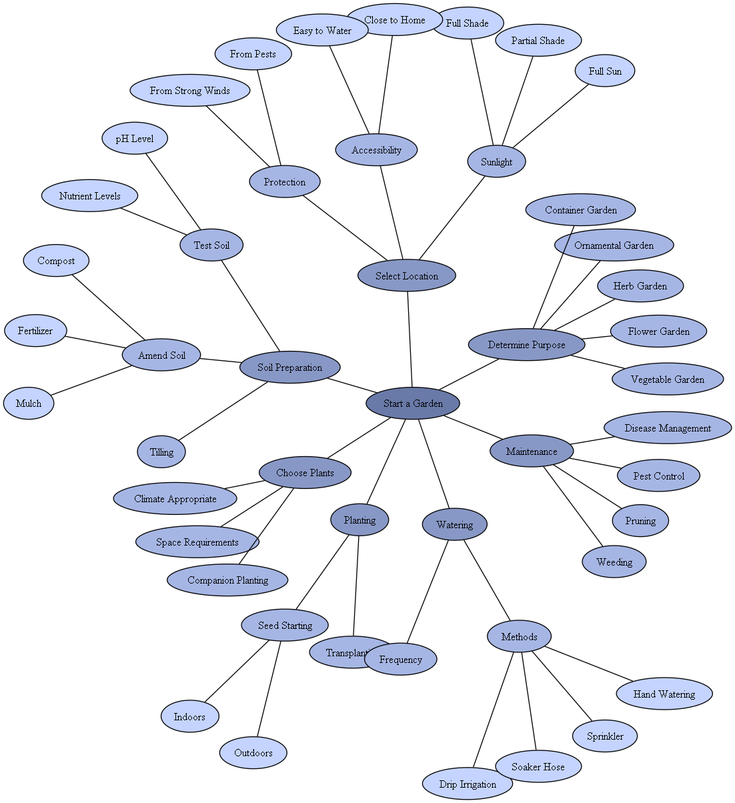

# OpenAI Mind Mapping Integration

## Introduction
This project aims to integrate mind mapping capabilities into the OpenAI API. The rationale behind this integration is the belief that mind mapping is more analogous to the functioning of the human brain than traditional generative AI models that predict the next word in a sequence.

For my first example I used the complex question "How do I start a garden" I had chatGPT return the mind map steps in JSON format
and used MindMap.py to create the map

## Motivation
The human brain organizes and processes information in a network of interconnected nodes. Mind mapping is a visualization technique that captures this essence by representing thoughts, ideas, and information in a structured, hierarchical manner.

By merging the capabilities of OpenAI's GPT models with mind mapping, we can facilitate a more natural, intuitive way of information processing and generation.

## Features
- **Dynamic Mind Map Creation**: Generate mind maps based on user inputs and queries.
- **Visualization**: Represent complex ideas and sequences in a structured visual format.
- **Expandable Nodes**: Dive deeper into specific topics or areas by expanding nodes.
- **Integration with OpenAI API**: Leverage the power of OpenAI's models to populate and expand the mind map.

## Usage
Install Graphviz (eventually with chocolatey)
To make a mind map with Python you need to install Graphviz at this [web page](https://graphviz.org/download/).
You could use also chocolatey to install Graphviz.

Install pydot
Now we’re ready to install pydot in the cmd (command line) or powershell:
pip install pydot

Add Graphviz to the path
specific to your graphviz file path, mine is:
os.environ["PATH"] += os.pathsep + "C:\\Program Files\\Graphviz\\bin"

## Future Work
- **Interactive UI**: Develop a user interface for real-time interaction and editing of the mind map.
- **Collaboration Features**: Allow multiple users to collaborate and contribute to a shared mind map.
- **Export/Import Capabilities**: Enable users to export their mind maps to various formats and import existing ones.

## Contributions
Contributions are welcome! Please feel free to open an issue or submit a pull request.

## License
This project is licensed under the MIT License - see the [LICENSE.md](LICENSE.md) file for details.
